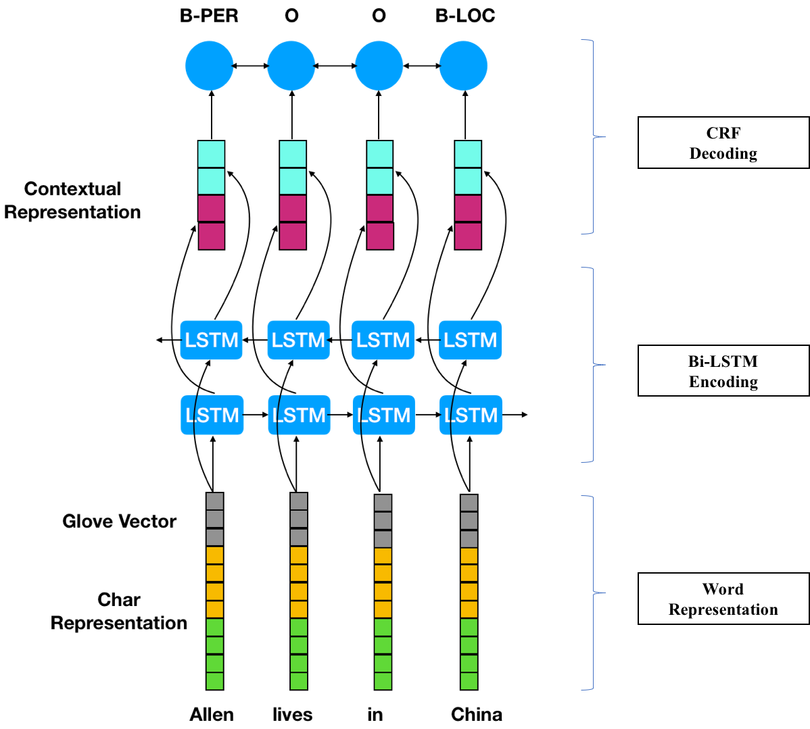

# SequenceTagging
自然语言处理中的序列标注实现，包括
* glove词向量处理
* vocab生成
* Bi-LSTM + CRF 模型
* early stop
* learning rate decay

模型采用了Bi-LSTM + CRF，请见
其中采用了字符和Bi-LSTM encoding组成了单词的向量表示，如下图所示

运行方式：
1. make glove
	下载glove 向量文件，并且进行解压
2. make data
	处理train/dev/test数据，构建vocab和trimmed_vector文件
3. make train
	构建模型，并进行训练，这里采用了学习率指数递减和early stop机制
4. make evaluate
	用训练得到的模型对test数据集进行测试

配置文件请见 config.cfg

